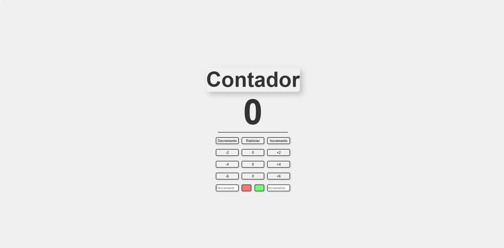
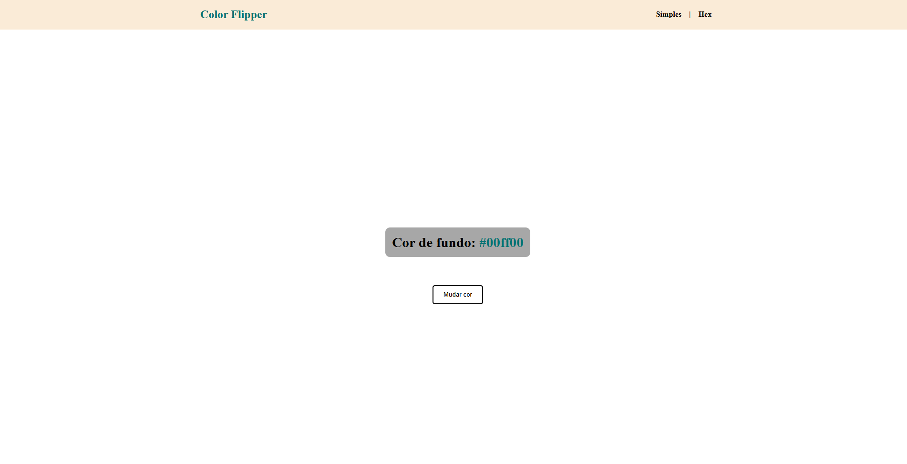

# 💼 Christian Zanella

**`Desenvolvedor Web`**
<!-- Sobre Mim -->
Tenho 17 anos e estou finalizando o Ensino Médio. Apaixonado por tecnologia, irei cursar **Engenharia de Software** e me tornar um **Desenvolvedor FullStack**. Atualmente, estudo de forma autodidata, explorando tanto o front-end quanto o back-end para construir soluções completas e eficientes.

## 🚀 Projetos

<!-- Projeto 1 - Counter-->

  <a href="https://github.com/chriszanella/counter" target="_blank">
    
    <h3 style="color: #9333ea;">Counter</h3>
    
Contador <strong style="color: #9333ea;">Especial</strong>

  </a>

<!-- Projeto 2 - Color Flipper -->

  <a href="https://github.com/chriszanella/color-flipper" target="_blank">
    
    <h3 style="color: #9333ea;">Color Flipper</h3>
    
Fliperama de <strong style="color: #9333ea;">Cores</strong>

  </a>

## 💻 Tecnologias

<!--Badge HTML -->

<!--Badge CSS -->

<!--Badge JavaScript -->

<!--Badge GitHub-->

<!--Badge Git -->

## 

